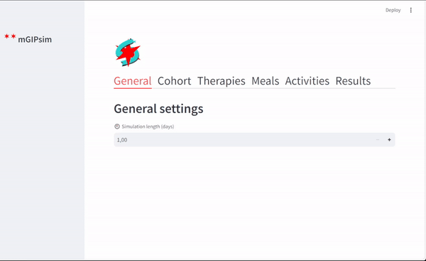

## **mGIPsim

Metabolic simulator of 20 virtual patients with type 1 diabetes, simulates physical activity, meal intakes, and insulin therapies.


## Requirements
* Python 3.12.0
* Dependencies can be installed via ``pip install -r requirements.txt``

## Usage
### Graphical User Interface
Provides a graphical user interface in a web app.

To run it locally:
```bash
streamlit run interface_gui.py
```



### Command Line - Interactive
Provides an interactive prompt environment to set the simulation settings.

Start by running ``interface_cmd.py``.


### Command Line - single command
Simulation settings are defined in a single command line.

Start by running ``interface_cli.py [OPTIONS]``.
